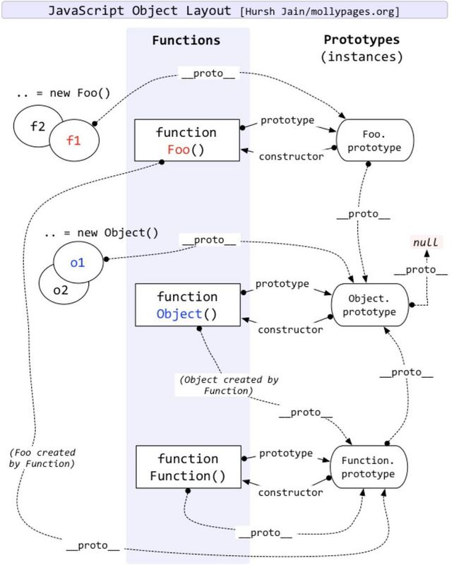

## 作用域概念
  - 存储变量当中的值，并且能在之后对这个值进行访问或者修改。

### 1. 编译原理
  &nbsp;JavaScript归类为**动态**或**解释执行**语言，但事实上，它是一门**编译语言**。但与传统的编译语言不相同，它**不是提前编译**的，编译结果也不能在分布式系统进行移植。对于JavaScript来说，大部分情况下编译发生在代码执行前的几微秒(甚至更短)的时间内。

### 2. 编译步骤
  - 分词/词法分析(Tokenizing/Lexing): 将由字符串组成的字符串分解成(对编程语言来说)有意义的代码块，这些代码块被称为词法单元(token)。

  - 解析/语法分析(Parsing): 将词法单元流(数组)转换成一个由元素逐级嵌套所组成的代表了程序语法结果的树。这个数被称为**抽象语法树(Abstract Syntax Tree, AST)**
  
  - 代码生成: 将AST转换为可执行代码的过程被称为代码生成。这个过程与语言、目标平台等息息相关。

    - JavaScript引擎不会有大量的(像其他语言编译器那么多的)时间来进行优化，因为与其他语言不通，JavaScript的**编译过程不是发生在构建之前的**。

    - 对于JavaScript来说，大部分情况下，编译发生在代码执行前的几微秒(甚至更短)的时间内。

### 3. 三大角色
  - 引擎: 从头到尾负责整个JavaScript程序的编译及执行过程。

  - 编译器：负责语法分析及代码生成等脏活累活。

  - 作用域：负责收集并维护有所有申明的标识符(变量)组成的一系列查询，并实施一套非常严格的规则，确定当前执行的代码对这些标识符的访问权限。

    - 申明在编译阶段进行，赋值会在执行阶段进行。

    - 变量的赋值操作会执行两个动作，首先编译器会在当前作用域中申明一个变量(如果之前没有申明过)，然后再运行时引擎会在作用域中查找该变量，如果能够找到就会对它赋值。

    - 编译器在编译过程的第二步中生成了代码，引擎执行它时，会通过查找变量a来判断它是否已申明过。查找过程由作用域进行协助，但是引擎执行怎样的查找，会影响最终的查找结果。
 
    - RHS: 简单查找某个变量的值。不成功的RHS引用会导致抛出ReferenceError异常。
      
      - retrieve his source value(取到它的源值)

    - LHS: 找到变量的容器本身，从而可以对其进行赋值。已成功的LHS引用会导致自动隐式创建一个全局变量(非严格模式下),该变量使用LHS引用的目标作为标识符，或者抛出ReferenceError异常(严格模式下)。

      - a = 2; // 只关心变量的容器本身，并不关心当前的值是什么

    - 案例
      ```
        function foo(a) {
            var b = a;
            return a + b;
        }
        var c = foo(2);
        # 所有LHS查询(3处): c = ..; a = 2(隐式变量分配) b = ..
        # 所有RHS查询(4处): foo(2) a; a b
      ```

### 4.var a=2;过程解析
  - 首先，var a在其作用域中申明新变量。这会在最开始的阶段，也就是代码执行前进行。

  - 接下来，a = 2会查询(LHS查询)变量a并对其进行赋值，这个赋值申明会被留在原地等待执行阶段。

### 5. foo(); function foo(){console.log('a');};过程解析
  - 首先， function foo(){console.log('a');};在其作用域中申明变量，这会在最开始的阶段，也就是代码执行前进行。

  - 接下来，foo();会进行查询(RHS查询)并发现为函数，进行调用执行。

### 6.异常(区分LHS和RHS重要性)
  - RHS查询，在所有嵌套的作用域中遍寻不到所需的变量，引擎会抛出ReferenceError异常

  - LHS查询，在**非严格模式下**,如果在全局作用域中也无法找到目标变量，全局作用域中就会创建一个具有该名称的变量，并将其返还给引擎；在**严格模式下**，同RHS抛出一样异常
```
  function foo(){
    console.log(a + b);
    b =a ;
  }
  foo(2);
```

## 词法作用域
  &nbsp;是一套关于引擎如何寻找变量以及会在何处找到变量的规则。词法作用域最重要的特征是它的定义过程发生在代码的书写阶段(假设你没有使用eval()或者with)。

  - 词法作用域意味着作用域由书写代码时函数申明的位置来决定的。编译的词法分析阶段基本能够知道全部标识符在哪里以及是如何申明的，从而能够预测在执行过程中如何对它们进行查找。


### 1. 词法阶段
  - 作用域气泡案例：

    - 这个案例中含有是哪些逐级嵌套的作用域

        1. 包含着整个全局作用域，其中只有一个标识符: foo;

        2. 包含着foo所创建的作用域，其中有三个标识符: a, bar, b；

        3. 包含着bar所创建的作用域，其中只有一个标识符: c。 
    ```
        function foo(a) {
            var b = a * 2;
            function bar(c) {
                console.log(a, b, c);
            }

            bar(b * 3);
        }

        foo(2); 
    ```
  
  - 无论函数在哪里被调用，也无论它如何被调用，它的词法作用域都只由函数被申明时所处的位置决定。
  
### 2. 欺骗词法
  - eval案例:
    - 在非严格模式下，会导致foo(..)的词法作用域进行了修改。这段代码实际上在foo(..)内部创建一个变量b，并遮蔽了外部(全局)作用域中的同名变量。

    - 在严格模式下，eval(..)在运行时有其自己的词法作用域，意味着其中的申明无法修改所在的作用域。因此会抛出ReferenceError异常。

    - setTimeout()第一个参数、setInterval()第一个参数、new Function()最后一个参数 均不建议使用。
    
    ```
        function foo(str, a) {
            eval(str);  // 欺骗
            console.log(a, b);
        }
        var b = 2;
        foo("var b = 3;", 1);  // 1, 3
    ```

  - with案例:
    - 当我们将o1传递进去，此时with所申明的作用域为o1，而这个作用域中含有一个同o1.a属性相符的标识符，a = 2赋值操作找到了o1.a并将2赋值给它。

    - 当我们将o2传递进去，此时with所申明的作用域为o2，而这个作用域中没有找到标识符o2.a，o2并没有a属性，因此不会创建这个属性，o2.a保持undefined；因此当a = 2执行时，自动创建了一个全局变量(非严格模式LHS)。
   
    ```
        function foo(obj) {
            with (obj) {
                a = 2;
            }
        }
        var o1 = {
            a: 3
        };
        var o2 = {
            b: 3
        } 
        foo(o1);
        console.log(o1.2);  // 2

        foo(o2);  
        console.log(o2.a);  // undefined
        console.log(a);  // 2-------不好，a被泄露到全局作用域上了
    ```

## 函数作用域
  - 属于这个函数的全部变量都可以在整个函数的范围内使用及复用(事实上在嵌套的作用域中也可以使用)。

### 1.立即执行函数表达式(Immediately Invoked Function Expression)
  - 由于函数被包含在一堆()括号内部，因此成为了一个表达式。

  - foo被绑定在函数表达式自身的函数中，而不是所在的作用域中。

  - 函数表达式可以是匿名的，函数申明不可以省略函数名。

  - 匿名函数缺点:
    - 匿名函数在栈追踪中不会显示出有意义的函数名，使得调试很困难。

    - 如果没有函数名，当函数需要引用自身时只能使用已经过时的arguments.callee引用。

    - 匿名函数省略了对于代码可读性/可理解性很重要的函数名。

    - 始终给函数表达式命名是一个最佳的实践。
  ```
    var a = 2;

    (function foo() {
      var a = 3;
      console.log(a);  // 3
    })();  // 立即执行函数表达式第一种写法

    (function foo(){
      var a = 3;
      console.log(a);
    }());  // 立即执行函数表达式第二种写法
    console.log(a);  // 2
  ```

### 2. 立即执行函数表达式进阶写法
```
  var a = 2;
  (function foo(global){
    var a = 3;
    console.log(a);  // 3
    console.log(global.a); // 2
  })(window);
```

## 块级作用域
  - 

### 1. try/catch
    ```
      try{
        undefined();  // 执行一个非法操作来强制制造一个异常
      }
      catch(error){
        console.log(error);  // 能够正常执行
      }
      console.log(error);  // ReferenceError: err not found
    ```

### 2. with
  - with从对象中创建出的作用域仅在with申明中而非外部作用域中有效。

### 3. let
  - 

### 4. const
  -

## 提升
  - 任何申明在某个作用域内的变量，都将附属于这个作用域。

### 1.函数优先
  - 函数申明和变量申明都会被提升，但是如果同时存在，**函数会首先被提升**，然后才是变量。

  - 尽管重复的val申明会被忽略掉，但出现在后面的函数申明还是可以覆盖前面的。

  - 尽可能避免在块内部申明函数。

  - 无论作用域中的申明出现在申明地方，都将在代码本身被执行之前首先进行处理，可以将这个过程形象地想象成所有的申明(变量和函数)都会被'移动'到各自作用域的最顶端,这个过程被称为**提升**。

  - 案例：
    ```
      foo();  // 1
      
      var foo;

      function foo() {
        console.log(1);
      }

      foo = function() {
        console.log(2);
      }

    - 这段代码，会被引擎理解为如下形式:

     function foo() {
       console.log(1);
     }

     foo();  // 1

     foo = function() {
       console.log(2);
     }
    ``` 
  
  - 案例2:
    ```
      foo();  // b
      var a = true;
      if(){
        function foo(){
          console.log('a');
        }
      }else{
        function foo(){
          console.log('b');
        }
      }
    ```

## 作用域闭包
  &nbsp;当函数可以记住并访问所在的词法作用域，即使函数是在当前词法作用域之外执行，这时就产生了**闭包**。

### 1. 闭包案例
  - 在foo()执行后，通常会期待foo()的整个内部作用域都被销毁，因为我们知道引擎有垃圾回收器用来释放不再使用的内存空间。然后，闭包可以阻止该事件发生,使其内部作用域依然存在，因此没有被回收。
    ```
      function foo(){
        var a = 2;
        function bar(){
          console.log(a);
        }
        return bar;
      }
      var newBar = foo();
      newBar();  // 2
    ```

  - 无论使用何种方式对函数类型的值进行传递，当函数在别处被调用时都可以观察到闭包。
    ```
      function foo(){
        var a = 2;
        function bar(){
          console.log(a);
        }
        baz(bar);
      }
      function baz(fn){
        fn();  // 2
      }
    ```

  - 通过间接的方式传递函数
    ```
      var fn;
      function foo(){
        var a = 2;
        function bar(){
          console.log(a);
        }
        fn = bar;
      }
      function baz(){
        fn(); // 2
      }
      foo();
      bar();
    ```

### 2. 定时器闭包
  - 内置的工具函数setTimeout()的回调函数，其所引用的函数就是一个闭包。

    ```
      function wait(msg){
        setTimeout(function timer(){
          console.log(msg);
        });
      }
      wait('hello world');
    ```

  - 闭包解决for循环问题

  ```
    for(var i=0; i<=5; i++>){
      (function(j){
        setTimeout(function timer(){
          console.log(j);
        }, 0);
      })(i);
    } // 如果没有闭包，则输出的一直为6
  ```

## 动态作用域
  - 动态作用域是在运行时确定的(this就是),关注函数从何调用。

    ```
      function foo() {
        console.log(a); // 3(而不是2)
      }

      function bar() {
        var a = 3;
        foo();
      }

      var a = 2;
      bar();
    ```
  
  - this词法

    - setTimeout导致函数与this之前的绑定丢失
      ```js
        var obj = {
          id: 'awesome',
          cool: function coolFn(){
            console.log(this.id);
          }
        };
        var id = 'not awesome';
        obj.cool();  // awesome
        setTimeout(obj.cool, 100);  // not awesome
      ```
    
    - 解决方案==申明变量
      ```js
        var obj = {
          id: 'awesome',
          cool: function coolFn(){
            var self = this,
            setTimeout(function timer(){
              console.log(self.id);
            }, 100);
          }
        };
        obj.cool();  // awesome
      ```
    
    - 解决方案==箭头函数
      - **箭头函数**放弃了所有普通this绑定的规则，取而代之的是用当前的词法作用域覆盖了this本来的值。
      ```js
        var obj = {
          id: 'awesome',
          cool: function coolFn(){
            setTimeout(() => {
              console.log(this.id);
            }, 100);
          }
        };
        obj.cool();  // awesome
      ```

    - 解决方案==bind
      ```js
        var obj = {
          id: 'awesome',
          cool: function coolFn(){
            setTimeout(function timer(){
              console.log(this.id);
            }.bind(this), 100);
          }
        };
        obj.cool();  // awesome
      ```

## this理解
  - 当一个函数被调用时，会创建一个活动记录(有时候也被称为执行上下文)。这个记录会包含函数在哪里被调用(调用栈)、函数的调用方式、传入的参数等信息。this就是记录的其中一个属性，会在函数执行的过程中用到。

### 1. 默认绑定
  - 无法应用其他规则时候，使用默认规则，在**非严格模式**下，默认规则this绑定全局对象，在**严格模式**下，默认规则this绑定在undefined。

    - 非严格模式下

      ```js
        function test(){
          console.log(this.a);
        }
        var a = 2;
        test();  // 2
      ```
    
    - 严格模式下

      ```js
        function test(){
          "use strict";
          console.log(tis.a);
        }
        var a = 2;
        test();  // this is not undefined
      ```
### 2. 隐式绑定
  - 当函数引用有上下文对象时，隐式绑定规则会把函数调用中的this绑定到这个上下文对象中。

    ```js
      function test(){
        console.log(this.a);
      }
      var obj = {
        a: 20,
        test: test
      };
      obj.test();  // 20
    ```
  
  - 对象属性引用链只有最顶层或则说最后一层会影响调用位置。

    ```js
      function test(){
        console.log(this.a);
      }
      var obj = {
        a: 20,
        test: test
      };
      var obj2 = {
        a: 30,
        obj: obj
      };
      obj2.obj.test(); // 20
    ```
  
  - 隐式丢失，最后会采用默认绑定规则
    ```js
      function test(){
        console.log(this.a);
      }
      var obj = {
        a: 20,
        test: test
      };
      var a = 'global';
      var ttt = obj.test;
      ttt();  // global
    ```
  
  - 隐式丢失，回调函数
    ```js
      function test(){
        console.log(this.a);
      }
      var obj = {
        a: 20,
        test: test
      };
      function foo(fn){
        fn();
      }
      var a = 'global';
      foo(obj.test);  // global
    ```

  - 隐式丢失,内置函数
    ```js
      function test(){
        console.log(this.a);
      }
      var obj = {
        a: 20,
        test: test
      };
      var a = 'global'
      setTimeout(obj.test, 100);  // global

      // JS环境下内置的setTimeout()函数实现和下面的伪代码类似:
      function setTimeout(fn, delay){
        // 等待delay毫秒后
        fn();  // <----调用位置---->所以导致隐式丢失
      }
    ```

  - 间接引用
    ```js
    function foo(){
      console.log(this.a);
    }
    var a = 4;

    var obj = {
      a: 100,
      foo: foo
    };

    obj.foo();  // 100
    var objFoo = obj.foo;
    objFoo();  // 4

    /*
      fun.foo = obj.foo的返回值是目标函数的引用，所以调用位置是foo()而不是fun.foo()或则obj.foo()
    */
    var fun = {a: 200};
    (fun.foo = obj.foo)();  // 4
    ```

  - 隐式绑定的小测试

    ```js
    var num = 1;
    var myObject = {
        num: 2,
        add: function () {
            this.num = 3;  // 隐式绑定  修改myObject.num = 3
            (function () {
                // "use strict";
                console.log(num);  // 默认绑定 非严格模式: 输出1 
                console.log(this.num);  // 默认绑定  非严格模式: 输出1 严格模式: 报错
                this.num = 4;   // 默认绑定 修改window.num = 4;
            })();
            console.log(this.num);  // 隐式绑定 3
        },
        sub: function () {
            console.log(this.num);  
        }
    }
    myObject.add();
    console.log(myObject.num);
    console.log(num);
    var sub = myObject.sub;
    sub();  // 丢失隐式绑定 4
    ```

### 3. 显示绑定
  - JavaScript提供的绝大多数函数以及你自己创建的所有函数都可以使用call()和apply()方法。

    ```js
      function foo(){
        console.log(this.a);
      }
      var obj = {
        a: 20
      };
      foo.call(obj);  // 20
    ```
    - 如果你传入了一个原始值(字符串类型，布尔类型、数字类型)来当做this的绑定对象，这个原始值会被转换成它的对象形式(也就是new String()、new Number()、new Boolean())，这就是通常所称为**装箱**。

    - 显示绑定依然无法解决隐式绑定的丢失问题。

  - 硬绑定
    ```js
      function foo(){
        console.log(this.a);
      }
      var obj = {
        a: 20
      };
      var bar = function(){
        foo.call(obj);
      };
      bar();  // 2
      setTimeout(bar, 10);  // 2
      bar.call(window);  // 2
    ```
      - 强制将foo绑定在obj上，不管外部如何调用，内部总是foo被绑定在obj上，因此我们称之为**硬绑定**。

      - 硬绑定的典型场景就是创建一个包裹函数，传入所有参数并返回接收到的所有值。
        ```js
          function foo(something){
            console.log(this.a, something);
            return this.a + something;
          }
          var obj = {
            a: 20
          };
          var bar = function(){
            return foo.apply(obj, arguments);
          };
          var value = bar(10);  // 20 10
          console.log(value);  // 30
        ```
      
      - 硬绑定的第二种实现方式，创建一个通用的辅助函数。
        ```js
          function foo(something){
            console.log(this.a, something);
            return this.a + something;
          }
          var obj = {
            a: 20
          };

          // 创建一个辅助函数
          function bind(fn, object){
            return function(){
              return fn.apply(object, arguments);
            };
          }
          var bar = bind(foo, obj);
          var value = bar(10);  // 20 10
           console.log(value);  // 30
        ```

      - 硬绑定在ES5中实现Function.prototype.bind
        ```js
          function foo(something){
            console.log(this.a, something);
            return this.a + something;
          }
          var obj = {
            a: 20
          };
          var bar = foo.bind(obj);
          var value = bar(10);  // 20, 10
          console.log(value);  // 30
        ```

        - bind()会返回一个硬绑定的新函数，它会把参数设置为this的上下文并调用原始函数。

      - API调用的``上下文``
        - js许多内置函数提供了一个可选参数，被称为``上下文(context)``，其作用和bind()一样，确保回调函数使用指定的this。这些函数实际上通过call()和apply()实现了显示绑定
          ```js
          function foo(el){
            console.log(el + '----' + this.id);
          }

          var obj = {
            id: 'obj'
          };

          var arr = [1, 3, 5];
          arr.forEach(foo, obj);
          /*
            1----obj
            3----obj
            5----obj
          */
          ````

### 4. new绑定
  - 在JavaScript中，构造函数只是一些使用new操作符时被调用的函数，它们仅仅是被new操作符调用的普通函数而已。

  - 包括内置对象函数(比如Number())在内的所有函数都可以用new来调用，这种函数调用被称为``构造函数调用``

  - 实际上并不存在所谓的``构造函数``，只有对于函数的``构造调用``

  - new来调用函数，或者说发生构造函数调用时，会自动执行以下步骤

    - 创建或者构造一个全新的对象。

    - 实例对象的__ proto__被自动创建

    - 这个新对象会被执行原型连接。

    - 这个新对象绑定到函数调用的this。

    - 如果函数没有返回其他对象，那么new表达式中的函数调用会自动返回一个新对象。

  - new的小测试
    
    ```js
    /*
        使用new操作符调用构造函数，实际上经历了4步骤:
            创建一个新对象

            将构造函数的作用域给新对象(this指向了这个对象)

            执行构造函数中的代码

            返回新对象
    */
    var name = 'window';

    function Person(name){
        this.name = name;
        this.show1 = function (){
            console.log(this.name);
        };
        this.show2 = () => console.log(this.name);
        this.show3 = function (){
            return function(){
                console.log(this.name);
            };
        };
        this.show4 = function (){
            return () => console.log(this.name);
        }
    }

    var personA = new Person('personA');
    var personB = new Person('personB');

    personA.show1();  // personA  隐式调用，调用者personA
    personA.show1.call(personB);  // personB  显示绑定，调用者personB

    personA.show2();  // personA  首先，personA是new绑定，产生了新的构造函数作用域，然后箭头函数绑定，this指向外层作用域即personA函数作用域
    personA.show2.call(personB);  // personA 箭头函数指向父级作用域

    personA.show3()();  // window  默认绑定，调用者window
    personA.show3().call(personB);  // personB 显示绑定，调用者是personB
    personA.show3.call(personB)();  // window  默认绑定，调用者window

    personA.show4()();  // personA  箭头函数绑定， this指向父级作用域
    personA.show4().call(personB);  // personA  箭头函数绑定， this指向父级作用域
    personA.show4.call(personB)();  // personB  箭头函数绑定，this指向父级作用域
    ```

### 5. 判断this指向
  - 函数是否在new中被调用，如果是的话this绑定的是新创建的对象。

  - 函数是否通过call、apply(显示绑定)或者硬绑定(bind)调用，如果是的话，this绑定的是指定的对象。

  - 函数是否在某个上下文对象中调用(隐式绑定)，如果是的话，this绑定的是上下文对象。

  - 如果都不是，则是默认绑定，在严格模式下，绑定的是undefined；非严格模式下，绑定的是全局对象。

### 6. 特殊场景this指向
  - 使用**null**来忽略this的指向，通常将``null``或则``undefined``作为this的绑定对象传入call、apply或则bind，这些值在调用时会被忽略，实际应用的是默认绑定。
    ```js
      function foo(a,b){
        console.log('a: ' + a + ', ' + 'b: ' + b);
      }
      foo.apply(null, [2, 3]);  // a: 2, b: 3 

      # 使用bind进行柯里化
      var bar = foo.bind(null, 2);
      bar(3);  // a: 2, b: 3
    ```
      - 使用null来忽略this的指向，可能会产生**副作用**，在非严格模式下，this指向window。
    
  - 使用**Object.create(null)**来忽略this的指向
    ```js
      function foo(a, b){
        console.log('a: ' + a, + ', ' + 'b: ' + b);
      }
      var ø = Object.create(null);
      var bar = foo.bind(ø, 2);
      bar(3);  // a: 2, b: 3
    ```

### 7. 软绑定
  - 硬绑定可以把this强绑定到指定的对象(new除外)，防止函数调用默认绑定规则。但是会降低函数的灵活性，使用``硬绑定之后就无法使用隐式或则显示绑定来修改this``

  - 如果给默认绑定指定一个全局对象或则undefined以外的值，那就可以实现和硬绑定相同的效果，同时保留隐式绑定或者显示绑定修改this的能力

    ```js
    /*
    
    */
    if(!Function.prototype.softBind){
      Function.prototype.softBind = function(obj){
        var fn = this;
        // 不会所有curried参数
        var curried = [].slice.call(arguments, 1);
        var bound = function(){
          return fn.apply(
            (!this || this === (window || global)) ? obj : this,
            curried.concat.apply(curried, arguments)  // 有疑问???
          );
        };
        bound.prototype = Object.create(fn.prototype);
        return bound;
      }
    }

    function foo(){
      console.log('name:' + this.name);
    }

    var obj = {
      name: 'obj'
    },
    obj2 = {
      name: 'obj2'
    },
    obj3 = {
      name: 'obj3'
    };

    // 默认绑定
    var fooObj = foo.softBind(obj);
    fooObj();  // obj

    // 隐式绑定
    obj2.foo = foo.softBind(obj);
    obj2.foo();  // obj2

    // 显示绑定
    fooObj.call(obj3);  // obj3

    // 隐式丢失
    setTimeout(obj2.foo, 10);  // obj
    ```
  
### 7. ES6的箭头函数this指向
  - 箭头函数不适用this指向的四种规则，其根据外层(函数或则全局)作用域来决定this的指向。

  - 箭头函数不绑定this，箭头函数中的this相当于普通变量。

  - 箭头函数的this寻值行为与普通变量相同，在作用域中逐级寻找。

  - 箭头函数的this无法通过bind、call、apply来直接修改。

    ```js
      /*
       foo()内部创建的箭头函数会捕获调用时foo()的this。
        由于foo()的this绑定到obj1，bar(引用箭头函数)的this也会绑定到obj1
      */
      function foo(){
        return (a) => {
          console.log(this.a);
        };
      }
      var obj1 = {
        a: 2
      };
      var obj2 = {
        a: 3
      };
      var bar = foo.call(obj1);
      bar.call(obj2);  // 2

      function fooES5(){
        var self = this;
        setTimeout(function(){
          console.log(self.a);
        }, 1000);
      }
    ```

  - 改变作用域中this的指向可以改变箭头函数的this。

    ```js
    function foo(){
      name = 'foo';
      return () => (console.log(this.name));
    }

    var obj = {
      name: 'obj'
    };

    foo.bind(obj)()();  // obj
    ```

  - 箭头函数小测试
    ```js
    /*
        非严格模式
    */
    var name = 'window';
    var person1 = {
        name: "person1",
        show1: function(){
            console.log(this.name);
        },
        show2: () => console.log(this.name),
        show3: function(){
            return function(){
                console.log(this.name);
            };
        },
        show4: function(){
            return () => console.log(this.name);
        }
    };

    var person2 = {
        name: "person2"
    };

    person1.show1();  // person1  隐式绑定， this指向调用者
    person1.show1.call(person2);  // person2 显示绑定，this指向person2

    person1.show2();  // window  箭头函数绑定，this指向外层作用域，即全局作用域
    person1.show2.call(person2);  // window 箭头函数绑定，this指向外层作用域，即全局作用域

    person1.show3()();  // person1----window  默认绑定，这个是一个高阶函数，调用者是window
    person1.show3().call(person2);  // person2  显示绑定，this指向person2
    person1.show3.call(person2)();  // person2---window  默认绑定，调用者是window

    person1.show4()();  // person1  箭头函数绑定，this指向外层作用域，即person1函数作用域
    person1.show4().call(person2);  // person1  箭头函数绑定， 指向person1函数作用域
    person1.show4.call(person2)();  // person2  将show4的函数作用域显示绑定为person2，箭头函数绑定指向父级作用域
    ```

## 对象
  - 基本数据类型number、string、number、boolean、unll、undefined，本身不是对象。

  - **typeof null**结果为object，不同对象底层均表示为二进制，在JavaScript中二进制前三位均为0的，均被当做对象，null的二进制全是0，所以会返回object。

  - 内置对象Number、String、Boolean、Object、Function、Array、Date、Error、RegExp

  - 字面量是一个不可改变的值，在必要时候会自动转换成对象。

  - 对象的属性值为函数，但是这并不是其他语言所说的方法，在JavaScript中对象的属性为函数与普通的函数没有什么区别，唯一区别就是可能会发生this隐式绑定，因为最终this绑定取决于函数调用位置。

### 1. 创建对象的三种方式
  - 文字形式
    ```
      var obj = {
        name: 'hello',
        age: 18,
        eat: function(){
          console.log('---eating---');
        }
      }
    ```

  - 系统构造函数
    ```
      var obj = new Object();
      obj.name = 'hello';
      obj.age = 18;
      obj.eat = function(){
        console.log('---eat----');
      }
    ```

  - 自定义构造函数
    ```
      function Person(name, age){
        this.name = name;
        this.age = age;
        this.eat = function(){
          console.log('---eating---');
        }
      }
      var obj = new Person('hello', 18);
      obj instanceof Person; // true
      obj instanceof Object; // true
    ```
  
  - 工厂模式创建对象
    ```
      function createObject(name, age){
        var obj = new Object();
        obj.name = name;
        obj.age = age;
        obj.eat = function(){
          console.log('---eat---');
        }
        return obj;
      }
      var obj = createObject('hello', 18);
    ```

### 2. 构造函数与实例化对象之间关系
  - 实例对象是通过构造函数来创建的，创建过程称为**实例化**

  - 两种方式判断对象的数据类型
    - 通过构造函数(构造器)方式
      ```
        # 实例对象.构造器 == 构造函数(构造器)名字
        function Person(name, age){
          this.name = name;
          this.age = age;
          this.eat = function(){
            console.log('---eating---');
          }
        }
        var obj = new Person('hello', 18);
        console.log(obj.constructor == Person);
        console.log(obj.__proto__.constractor == Person);
        console.log(obj.__proto__.constructor==Person.prototype.constructor);
      ```

    - 通过instanceof方式(**首选方法**)
      ```
        console.log(obj instanceof Person);
      ```

### 3. 原型对象引入
  - 解决数据共享，节省内存空间
    ```
      function Person(name, age){
        this.name = name;
        this.age = age;
      }
      Person.prototype.eat = function(){
        console.log('---eating---');
      };
      var p1 = new Person('hello', 18);
      var p2 = new Person('world', 20);
      console.log(p1 == p2); // false
      console.log(p1.eat == p2.eat); // true
      console.dir(p1);
      console.dir(p2);
    ```

  - 原型对象
    -  实例对象中有__proto__属性，叫做隐式原型对象，浏览器使用

    - 构造函数中有prototype属性，叫做显式原型对象，程序员使用

    - per.__ proto__.constructor == Person.prototype.constructor

    - __proto__之所以给浏览器使用，因为不同浏览器兼容不一样，ie就没有该属性

### 4. 实例对象、构造函数、原型对象关系图
  - 实例对象的原型对象(__ proto__)指向的是构造函数的原型对象

  - 构造函数的原型对象(prototype)中的方法是可以被实例对象直接访问的

  - **原型链** ：是一种关系，实例对象和原型对象之间的关系，关系是通过原型(__ proto__)来联系的。

  - 构造函数的原型对象(prototype)指向发生改变，实例对象的原型(__ proto__)指向也会发生改变。

      

### 5. 原型语法
  - 手动修改构造器指向
    ```
      function Person(name, age){
        this.name = name;
        this.age = age;
      }
      Person.prototype = {
        constructor: Person,  // 手动修改构造器指向
        eye: 2,
        ear: 2,
        eat: function(){
          console.log('---eat---');
        }
      }
    ```

  - 原型中的方法，可以相互访问
    ```
      function Person(name, age){
        this.name = name;
        this.age = age;
      }
      Person.prototype.eat = function(){
        console.log('---eat---');
        this.drink();
      }
      Person.prototype.drink = function(){
        console.log('---drink---');
        this.sleep();
      }
      Person.prototype.sleep = function(){
        console.log('---sleep---');
      }
    ```
  - 实例对象使用的属性和方法层层调用关系
    - 首先**实例中查找**，然后**去创建该实例对象的的构造函数的原型对象中查找**

### 6.Object.create()
  - 返回值: 一个新对象，带着指定的原型对象和属性。

### 7. Object.getPrototypeOf()
  - 返回指定对象的原型对象

### 8. 属性设置和屏蔽
  - foo不直接存在obj中，而是存在于原型链上层时obj.foo = 'bar'会出现三种情况

    - 如果在__ proto__上层存在名为foo的普通数据访问属性，并且没有被标记为只读(writable:false)，那就会直接在obj中添加一个名为foo的新属性，它是**屏蔽属性**。======> 只读属性是什么意思？

    - 如果在__ proto__上层存在foo，但是它被标记只读(writable:false)，那么无法修改已有属性或则在obj上创建屏蔽属性。如果运行在严格模式下，代码会抛出错误。否则，这条赋值语句会被忽略。总之，不会发生屏蔽。

    - 如果在__ proto__上层存在foo并且它是一个setter，那就一定会调用这个setter。foo不会被添加到(或则说屏蔽于)obj，也不会重新定义foo这个setter。

  - 隐式屏蔽
    ```
      var obj1 = {
        a: 2
      };
      var obj2 = Object.create(obj1);
      console.log(obj2.a);  // 2
      console.log(obj1.a);  // 2
      console.log(obj1.hasOwnProperty('a'));  // false
      console.log(obj1.hasOwnProperty('a'))  // true

      // 隐式屏蔽
      obj2.a++;  // obj2.a = obj2.a + 1;
      console.log(obj2.a);  // 3
      console.log(obj1.a);  // 2
      console.log(obj2.hasOwnProperty('a'));  // true
    ```


### 3. 属性描述符
  - Object.getOwnPropertyDescriptor(obj, key)
    
    ```
      var obj = {
        a: 2
      };
      Object.getOwnPropertyDescriptor(obj, 'a');
      # 结果
      {
        value: 2,
        writable: true,
        enumerable: true,
        configurable: true
      }
    ```
  
  - Object.defineProperty(obj, key, {})
    ```
    var obj = {};
    Object.defineProperty(obj, key, {
      value: 2,
      writable: true,  // 是否可以重新赋值
      enumerable: true,  // 是否可以枚举,for in 遍历其属性
      configurable: true, // 是否可以重新定义，一旦为false，就不能重新配置，以及删除该key，单向操作。
    })
    `````

  - 对象常量：configurable:false, writable:false

  - 阻止扩展: Object.preventExtensions(obj)

  - 密封: Object.seal(),实质是在阻止扩展基础上加了configurable: false

  - 冻结: Object.freeze(),实质是在seal基础上加了wirtable: false
  
### 对象遍历
  - for...in循环可以用来遍历对象的可枚举属性列表(包括[prototype]链)。

  - for...of实现原理
    ```
      var obj = {
        a: 2,
        b: 3
      },
      Object.defineProperty(obj, Symbol.iterator, {
        enumerable: false,
        writable: false,
        configurable: false,
        value: function(){
          var _this = this;
          var index = 0;
          var keys = Object.keys(_this);
          return {
            next: function(){
              return {
                value: _this[keys[index++]],
                done: (index < keys.length>)
              };
            }
          };
        }
      })
      var iterator = obj[Symbol.iterator]();
      iterator.next();  // {value: 2, done: false}
      iterator.next();  // {value: 3, done: false}
      iterator.next();  // {value: undefined, done: true}
    ```