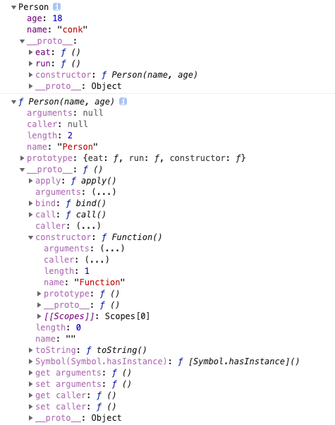

## 构造函数

### 1. 概念
  - 构造函数本身就死一个函数，与普通函数没有任何区别，不过为了规范将其首字母大写。构造函数和普通函数的区别在于，使用new生成实例的函数就是构造函数，直接调用的就是普通函数。


### 2. constructor属性
  - 返回创建实例对象时构造函数的引用。此属性的值是对函数本身的引用，而不是一个包含函数名称的字符串。

    ```javascript
    function Person(name, age){
        this.name = name;
        this.age = age;
    }

    Person.prototype.eat = function(){
        console.log('-----eat----');
    };
    
    Person.prototype.run = function(){
        console.log('----run-----');
    };

    var per = new Person('conk', 18);
    // per.__proto__ = Person.prototype
    console.dir(per);
    console.dir(Person);
    console.log(Person.constructor); 
    // 实例对象per的constructor属性是通过__proto__原型链进行访问的，并不是直接的per实例对象的属性
    console.log(per.constructor);  

    console.log('=============华丽分割线=============');
    function Demo(name, age){
        this.name = name;
        this.age = 18;
    }
    // 修改Demo原型对象
    Demo.prototype = {
        eat: function(){
            console.log('-----demo--eat----');
        },
        run: function(){
            console.log('----demo--run----');
        }
    };
    var de  = new Demo('conk', 18);
    console.dir(de);
    console.dir(Demo);
    console.log(Demo.constructor);
    console.log(de.constructor);
    ```
        
        
  
  - 普通函数是不是没有constructor属性?
    
    -  普通函数与构造函数并没有什么区别

    - 有没有constructor属性，取决于其``对象``有没有constructor属性

      ```javascript
      function fn(age){
        this.age = age;
      }
      var f1 = fn(20);
      console.log(f1);  // undefined
      console.log(f1.constructor);  // 报错
      console.log(fn.constructor);  // f Function() { [native code] }

      function fun(age){
        return {
          age: age
        };
      }
      var fun1 = fun(20);
      console.log(fun1.constructor);  // f Object() { [native code] }
      console.log(fun1.constructor === Object);  // true
      ```
  
  - constructor值只读吗？

    - 对于引用类型来说constructor属性值是可以修改的，但对于基本类型来说是只读的。
    
    - 依赖一个对象的constructor属性并不安全
    
    - 构建基本类型值得是只读的原生构造函数(native constructors)

      ```js
      function Type(){

      };

      var types = [1, 'conk', true, Symbol(123)];
      for(var i=0; i<types.length; i++>){
        types[i].constructor = Type;
        types[i] = [types[i].constructor, types[i] instanceof Type, types[i].toString()];
      }

      console.log(types.join('\n'));
      // function Number() { [native code] }, false, 1
      // function String() { [native code] }, false, conk
      // function Boolean() { [native code] }, false, true
      // function Symbol() { [native code] }, false, Symbol(123)
      ```

### 3.Symbol是构造函数吗
  - ``Symbol``是基本数据类型，但作为构造函数来说它并不完整，因为它不支持语法``new Symbol()``，Chrome认为其不是构造函数，如果要生成实例对象直接使用``Symbol()``即可

  - ``Symbol``虽然是基本数据类型，但是其实例可以获取constructor属性值,即Symbol原型上的constructor属性值
  
    ```js
    var sym = Symbol(123);
    console.log(sym.constructor);  // f Symbol() { [native code] }
    ```

  
