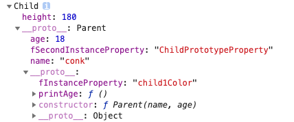
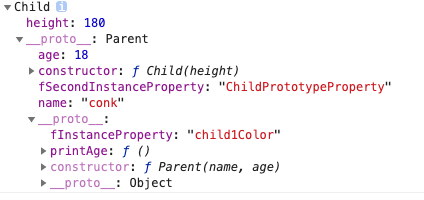

## 对象
  - 基本数据类型number、string、number、boolean、unll、undefined，本身不是对象。

  - **typeof null**结果为object，不同对象底层均表示为二进制，在JavaScript中二进制前三位均为0的，均被当做对象，null的二进制全是0，所以会返回object。

  - 内置对象Number、String、Boolean、Object、Function、Array、Date、Error、RegExp

  - 字面量是一个不可改变的值，在必要时候会自动转换成对象。

  - 对象的属性值为函数，但是这并不是其他语言所说的方法，在JavaScript中对象的属性为函数与普通的函数没有什么区别，唯一区别就是可能会发生this隐式绑定，因为最终this绑定取决于函数调用位置。

### 1. 创建对象的三种方式
  - 文字形式
    ```js
    var obj = {
      name: 'hello',
      age: 18,
      eat: function(){
        console.log('---eating---');
      }
    }
    ```

  - 系统构造函数
    ```js
    var obj = new Object();
    obj.name = 'hello';
    obj.age = 18;
    obj.eat = function(){
      console.log('---eat----');
    }
    ```

  - 自定义构造函数
    ```js
    function Person(name, age){
      this.name = name;
      this.age = age;
      this.eat = function(){
        console.log('---eating---');
      }
    }
    var obj = new Person('hello', 18);
    console.dir(Person);
    console.dir(obj);
    obj instanceof Person; // true
    obj instanceof Object; // true
    ```
  
  - 工厂模式创建对象
    ```js
    function createObject(name, age){
      var obj = new Object();
      obj.name = name;
      obj.age = age;
      obj.eat = function(){
        console.log('---eat---');
      }
      return obj;
    }
    var obj = createObject('hello', 18);
    ```

### 2. 构造函数与实例化对象之间关系
  - 实例对象是通过构造函数来创建的，创建过程称为**实例化**

  - 两种方式判断对象的数据类型
    - 通过构造函数(构造器)方式
      ```js
      // 实例对象.构造器 == 构造函数(构造器)名字
      function Person(name, age){
        this.name = name;
        this.age = age;
        this.eat = function(){
          console.log('---eating---');
        }
      }
      var obj = new Person('hello', 18);
      console.log(obj.constructor == Person);
      console.log(obj.__proto__.constractor == Person);
      console.log(obj.__proto__.constructor==Person.prototype.constructor);
      ```

    - 通过instanceof方式(**首选方法**)
      ```js
      console.log(obj instanceof Person);
      ```

### 3. 原型对象引入
  - 解决数据共享，节省内存空间
    ```js
    function Person(name, age){
      this.name = name;
      this.age = age;
    }
    Person.prototype.eat = function(){
      console.log('---eating---');
    };
    var p1 = new Person('hello', 18);
    var p2 = new Person('world', 20);
    console.log(p1 == p2); // false
    console.log(p1.eat == p2.eat); // true
    console.dir(p1);
    console.dir(p2);
    ```

  - 原型对象
    -  实例对象中有__proto__属性，叫做隐式原型对象，浏览器使用

    - 构造函数中有prototype属性，叫做显式原型对象，程序员使用

    - per.__ proto__.constructor == Person.prototype.constructor

    - __proto__之所以给浏览器使用，因为不同浏览器兼容不一样，ie就没有该属性

### 4. 实例对象、构造函数、原型对象关系图
  - 实例对象的原型对象(__ proto__)指向的是构造函数的原型对象

  - 构造函数的原型对象(prototype)中的方法是可以被实例对象直接访问的

  - **原型链** ：是一种关系，实例对象和原型对象之间的关系，关系是通过原型(__ proto__)来联系的。

  - 构造函数的原型对象(prototype)指向发生改变，实例对象的原型(__ proto__)指向也会发生改变。

      

### 5. 原型语法
  - 手动修改构造器指向
    ```js
    function Person(name, age){
      this.name = name;
      this.age = age;
    }
    Person.prototype = {
      constructor: Person,  // 手动修改构造器指向
      eye: 2,
      ear: 2,
      eat: function(){
        console.log('---eat---');
      }
    }
    ```

  - 原型中的方法，可以相互访问
    ```js
    function Person(name, age){
      this.name = name;
      this.age = age;
    }
    Person.prototype.eat = function(){
      console.log('---eat---');
      this.drink();
    }
    Person.prototype.drink = function(){
      console.log('---drink---');
      this.sleep();
    }
    Person.prototype.sleep = function(){
      console.log('---sleep---');
    }
    ```
  - 实例对象使用的属性和方法层层调用关系
    - 首先**实例中查找**，然后**去创建该实例对象的的构造函数的原型对象中查找**

### 7. Object.getPrototypeOf()
  - 返回指定对象的原型对象

### 8. 属性设置和屏蔽
  - foo不直接存在obj中，而是存在于原型链上层时obj.foo = 'bar'会出现三种情况

    - 如果在__ proto__上层存在名为foo的普通数据访问属性，并且没有被标记为只读(writable:false)，那就会直接在obj中添加一个名为foo的新属性，它是**屏蔽属性**。======> 只读属性是什么意思？

    - 如果在__ proto__上层存在foo，但是它被标记只读(writable:false)，那么无法修改已有属性或则在obj上创建屏蔽属性。如果运行在严格模式下，代码会抛出错误。否则，这条赋值语句会被忽略。总之，不会发生屏蔽。

    - 如果在__ proto__上层存在foo并且它是一个setter，那就一定会调用这个setter。foo不会被添加到(或则说屏蔽于)obj，也不会重新定义foo这个setter。

  - 隐式屏蔽
    ```js
      var obj1 = {
        a: 2
      };
      var obj2 = Object.create(obj1);
      console.log(obj2.a);  // 2
      console.log(obj1.a);  // 2
      console.log(obj1.hasOwnProperty('a'));  // false
      console.log(obj1.hasOwnProperty('a'))  // true

      // 隐式屏蔽
      obj2.a++;  // obj2.a = obj2.a + 1;
      console.log(obj2.a);  // 3
      console.log(obj1.a);  // 2
      console.log(obj2.hasOwnProperty('a'));  // true
    ```


### 3. 属性描述符
  - Object.getOwnPropertyDescriptor(obj, key)
    
    ```js
      var obj = {
        a: 2
      };
      Object.getOwnPropertyDescriptor(obj, 'a');
      # 结果
      {
        value: 2,
        writable: true,
        enumerable: true,
        configurable: true
      }
    ```
  
  - Object.defineProperty(obj, key, {})
    ```js
    var obj = {};
    Object.defineProperty(obj, key, {
      value: 2,
      writable: true,  // 是否可以重新赋值
      enumerable: true,  // 是否可以枚举,for in 遍历其属性
      configurable: true, // 是否可以重新定义，一旦为false，就不能重新配置，以及删除该key，单向操作。
    })
    `````

  - 对象常量：configurable:false, writable:false

  - 阻止扩展: Object.preventExtensions(obj)

  - 密封: Object.seal(),实质是在阻止扩展基础上加了configurable: false

  - 冻结: Object.freeze(),实质是在seal基础上加了wirtable: false
  
### 对象遍历
  - for...in循环可以用来遍历对象的可枚举属性列表(包括[prototype]链)。

  - for...of实现原理
    ```js
      var obj = {
        a: 2,
        b: 3
      },
      Object.defineProperty(obj, Symbol.iterator, {
        enumerable: false,
        writable: false,
        configurable: false,
        value: function(){
          var _this = this;
          var index = 0;
          var keys = Object.keys(_this);
          return {
            next: function(){
              return {
                value: _this[keys[index++]],
                done: (index < keys.length>)
              };
            }
          };
        }
      })
      var iterator = obj[Symbol.iterator]();
      iterator.next();  // {value: 2, done: false}
      iterator.next();  // {value: 3, done: false}
      iterator.next();  // {value: undefined, done: true}
    ```

## constructor作用
  ```js
  function Parent(name, age){
      this.name = name;
      this.age = age;
  }
  Parent.prototype.printAge = function(){
      console.log("Parent----", this.name, this.age);
  };

  function Child(height){
      this.height = height;
  }
  Child.prototype = new Parent('conk', 18);

  var parentPrototypeConstructor = Parent.prototype.constructor;
  console.log('---Parent---prototype.constructor===>', parentPrototypeConstructor);
  /*
      function Parent(name, age){
          this.name = name;
          this.age = age;
      }
  */
  
  var childPrototyeConstructor = Child.prototype.constructor;
  console.log('---Child---prototype.constructor===>', childPrototyeConstructor);
  /*
      function Parent(name, age){
          this.name = name;
          this.age = age;
      }
  */

  console.log('---未修改前====>', parentPrototypeConstructor === childPrototyeConstructor);  // true   

  var parentConstructor = Parent.constructor;
  console.log('---Parent---constructor===>', parentConstructor);
  /*
      f Function(){
          [native code]
      }
  */

  var childConstructor = Child.constructor;
  console.log('---Child---constructor====>', childConstructor);
  /*
      f Function(){
          [native code]
      }
  */

  var child1 = new Child(180);
  console.dir(child1);
  console.log('---child1 constructor----', child1.constructor);
  /*
      function Parent(name, age){
          this.name = name;
          this.age = age;
      }
  */
  child1.constructor.prototype.fInstanceProperty = 'child1Color';
  Child.prototype.fSecondInstanceProperty = 'ChildPrototypeProperty';

  // 修正
  // Child.prototype.constructor = Child;
  ```

   
   
     

  - 修改前后差别
    - 给子类绑定的共享方法不会污染到父类， 因为有时候子类的实例对象是通过闭包创建，想给子类绑定属性或方法，就得通过constructor进行访问，并且保证不能污染到父类。

    ```js
    var child;
    (function(){
        function Father (name) {
            this.name = name;
        }

        Father.prototype.sayName= function () {
            console.log(this.name);
        }
        child = new Father('aoyo');
    })()
    child.sayName();//aoyo
    
    // 本来可通过下面进行绑定属性或方法，但是闭包导致无法访问，所以必须借助constructor
    // Father.prototype.fSecondInstanceProperty = 'fSecondInstanceProperty';
    console.log(Father); // 报错, Father is not defined

    child.constructor.prototype.sayAge = function(age){
        console.log(age);
    }
    child.sayAge('20'); //20
    ```
  


## N种继承实现方式

### 1.原型链继承

  - 构造函数、原型和实例的关系: 每个构造函数都有一个原型对象，原型对象都包含一个指向构造函数的指针，而实例都包含一个原型对象的指针

  - 缺点: 多个实例对父类的引用类型属性操作，会造成篡改

```js
function Parent(){
    this.parentProperty = true;
    this.sameProperty = 'parentSame';
    this.colors = ['white', 'red'];
}
Parent.prototype.getParentValue = function(){
    return [this.parentProperty, this.sameProperty];
};

function Child(){
    this.childProperty = false;
    this.sameProperty = 'childSame';
}
/*
    核心步骤1
*/
Child.prototype = new Parent();
Child.prototype.getChildValue = function(){
    return [this.childProperty, this.sameProperty];
};

var child1 = new Child();
console.log(child1.getChildValue());  // [false, "childSame"]
console.log(child1.getParentValue());  // [true, "childSame"]

child1.childInstanceProperty = 'childInstanceProperty';
child1.colors.push('blue');

var child2 = new Child();
console.log(child2.colors);  // ["white", "red", "blue"]

console.dir(child1);
```

### 2.构造函数继承

  - 借用父类的构造函数来增强子类实例，等同于复制父类的实例给子类

  - 缺点: 只能继承父类的实例属性和方法，不能继承原型属性和方法

  - 缺点: 无法实现父类的复用，每个子类都有父类实例函数的副本，影响性能

```js
function Parent(){
    this.color = ['white', 'red'];
}

function Child(){
    /*
        关键步骤1
    */
    Parent.call(this);
}
var instance1 = new Child();
instance1.color.push('blue');
console.log(instance1.color);  // ["white", "red", "blue"]
console.dir(instance1);

var instance2 = new Child();
console.log(instance2.color);  // ["white", "red"]
console.dir(instance2);
```

### 3.组合继承

  - 原型链继承 + 构造函数继承, 用原型链实现对原型属性和方法的继承，用构造函数实现实例属性的继承

  - 缺点: 在使用子类创建实例对象时，其原型会存在两份相同的属性/方法

  - 缺点: 无法实现父类的复用，每个子类都有父类实例函数的副本，影响性能

```js
function Parent(name){
    this.name = name;
    this.color = ['red', 'blue'];
}
Parent.prototype.sayName = function(){
    console.log('parent----', this.name);
};
function Child(name, age){
    // 关键步骤2: 第二次调用Parent()
    Parent.call(this, name);
    this.age = age;
}
// 关键步骤1: 第一次调用Parent()
Child.prototype = new Parent();
Child.prototype.construtor = Child;
Child.prototype.sayAge = function(){
    console.log('child----', this.age);
};
/*
        缺点: 
            第一次调用Parent(): 给Child.prototype写入两个属性name, color
            第二次调用Parent(): 给instance1写入两个属性name, color
            属性赋值: 给实例对象instance1上的两个属性赋值，就屏蔽了其原型对象Child.prototype的两个同名属性。
            总结: 在使用子类创建实例对象时，其原型会存在两份相同的属性/方法

*/
var instance1 = new Child('conk', 18);
instance1.color.push('white');  
console.log(instance1.color);  // ["red", "blue", "white"]
instance1.sayName();  // parent---- conk
instance1.sayAge();  // child---- 18
console.dir(instance1);

var instance2 = new Child('pht', 20);
console.log(instance2.color);  // ["red", "blue"]
instance2.sayName();  // parent---- pht
instance2.sayAge();  // child---- 20
console.dir(instance2);
```

### 4.原型式继承

  - 利用一个空对象作为中介，将某个对象直接赋值给空对象构造函数的原型

  - 缺点: 原型链继承多个实例的引用类型属性指向相同，存在篡改可能

  - 缺点: 无法传递参数

```js
/*
    关键步骤1
*/
function CreateObj(obj){
    function Child(){
        
    }
    Child.prototype = obj;
    return new Child();
}

var parentInstance = {
    name: 'conk',
    colors: ['white', 'blue']
};

var childInstance = CreateObj(parentInstance);
childInstance.name = 'pht';
childInstance.colors.push('red');

parentInstance.name = 'penghantian';
parentInstance.colors.push('green');

console.dir(childInstance);

var childInstance2 = CreateObj(parentInstance);
childInstance2.name = 'child2';
childInstance2.colors.push('yellow');
console.dir(childInstance2);
```

### 5.寄生式继承

  - 在原型式继承的基础上，增强对象，返回构造函数

  - 缺点: 原型链继承多个实例的引用类型属性指向相同，存在篡改可能

  - 缺点: 无法传递参数

```js
/*
    关键步骤1
*/
function CreateObj(obj){
    function Child(){

    }
    Child.prototype = obj;
    return new Child();
}

/*
    寄生式继承
        在原型式继承的基础上，增强对象。

        缺点: 
            原型链继承对个实例的引用类型属性指向相同，存在篡改可能
            无法传递参数
*/
function enhanceChild(obj){
    var childInstance = CreateObj(obj);
    // 增强对象
    childInstance.eat = function(){
        console.log('===eat==');
    };
    return childInstance;
}

var parentInstance = {
    name: 'conk',
    colors: ['white', 'red'],
};

var childInstance = enhanceChild(parentInstance);
childInstance.eat();  // ===eat===
childInstance.name = 'pht';
childInstance.colors.push('green');
console.log(childInstance.colors);  // ["white", "red", "green"]
console.dir(childInstance);

var childInstance2 = enhanceChild(parentInstance);
childInstance2.eat();  // ===eat===
childInstance2.name = 'penghantian';
childInstance.colors.push('yellow');
console.log(childInstance2.colors);  // ["white", "red", "green", "yellow"]
console.dir(childInstance2);
```

### 6.寄生组合式继承

  - 借用构造函数继承方式，增强子类实例属性====支持传参、避免篡改

  - 继承父类构造函数所指向的原型对象的方法和属性===将子类prototype与父类的prototype通过一个中间对象进行关联

  - 优点: 只会调用一次Parent构造函数

  - 优点: 避免在Child.prototype上创建了不必要的、多余的属性

  - 优点: 原型链结构保持不变，因此还能正常使用instanceof和isPrototypeOf()

```js
function Parent(name, color){
    this.name = name;
    this.color = ["red", "blue"];
}

Parent.prototype.sayName = function(){
    console.log('parent----', this.name);
}

function Child(name, age){
    // 关键步骤1：
    Parent.call(this, name);
    this.age = age;
}

function inheritPrototype(child, parent){
    // 关键步骤2：
    var midObj = Object.create(parent.prototype);
    child.prototype = midObj;
    child.constructor = child;
}

inheritPrototype(Child, Parent);

Child.prototype.sayAge = function(){
    console.log("child----", this.age);
}

var instance1 = new Child('conk', 18);
instance1.color.push('yellow');
console.log(instance1.color);

var instance2 = new Child('pht', 20);
console.log(instance2.color);
```

### 7.混入方式继承多个对象

  - Object.assign将父类的原型上的函数或方法拷贝到子类原型上

```js
function Child(){
    // 关键步骤1：
    ParentA.call(this);
    ParentB.call(this);
    parentC.call(this);
}

// 继承一个父类的原型
Child.prototype = Object.create(ParentA.prototype);

// 继承另外一个父类的原型
// 关键步骤2：
Child.prototype = Object.create(ParentB.prototype);

// 
Object.assign(Child.prototype, ParentC.prototype);

// 重新指向constructor
Chid.constructor = Child;

Child.prototype.eat = function(){
    console.log('child----');
}
```

### 8.ES6继承extends

  - 函数申明会提升，类申明不会 

```js
class Parent {
    constructor(name, color){
        this.name = name;
        this.color = color;
    }

    get nameColor(){
        return this.calcNameColor();
    }

    calcNameColor(){
        return this.name + '====' + this.color;
    }
}

class Child extends Parent {
    constructor(name, color, age){
        super(name, color);
        this.age = age;
    }

    get nameColor(){
        return this.name + '====' + this.color + '=====' + this.age;
    }
}

var childInstance = new Child('conk', ['red', 'white'], 18);
console.log(childInstance.nameColor);
console.dir(childInstance);

var childInstance2 = new Child('pht', ['red', 'white', 'blue'], 20);
console.log(childInstance2.nameColor);
console.dir(childInstance2);

// extends继承的核心代码如下，其实和寄生组合式继承方式一样
function _inherits(child, parent){
    // 创建对象，创建父类原型的一个副本
    // 增强对象，弥补因重写原型而失去的默认的constructor属性
    // 指定对象，将新的创建的对象赋值给子类的原型
    Child.prototype = Object.create(parent && parent.prototype, {
        constructor: {
            value: child,
            enumerable: false,
            writable: true,
            configurable: true
        }
    });
    
    if(child){
        Object.setPrototypeOf ? Object.setPrototypeOf(child, parent) : child.__proto__ = parent;
    }
}
```

### 9.完美继承

  - 实现对静态属性进行复制

  ```js
  "use strict";
  function Parent(name){
      this.name = name;
      this.color = ["red", "blue"];
  }

  Parent.prototype.printColor = function(){
      console.log('parent----', this.color);
  }

  Parent.height = 100;

  function Child(name, age){
      // 关键步骤1：
      Parent.call(this, name);
      this.age = age;
  }

  Child.prototype = Object.create(Parent.prototype, {
      // 关键步骤2：
      constructor: {
          value: Child,
          writable: false
      },
      printAge: {
          value: function(){
              console.log('child----', this.age);
          }
      }
  });

  // 在必要情况，可以对原型对象进行冻结
  // Object.freeze(Child.prototype);

  // 在严格模式下，设置为不可写状态，重写constructor会报错。
  // Child.prototype.constructor = function (){};
  
  // 关键步骤3：
  var parentStaticKeys = Object.entries(Parent);
  for(var i=0; i<parentStaticKeys.length; i++){
      var staticKey = parentStaticKeys[i][0];
      var staticValue = parentStaticKeys[i][1];
      Child[staticKey] = staticValue;
  }

  var child = new Child('conk', 18);
  console.dir(child);

  child.printAge();  // child----18;

  child.printColor();  // parent----["red", "blue"];

  Child.height;  // 100
  ```

