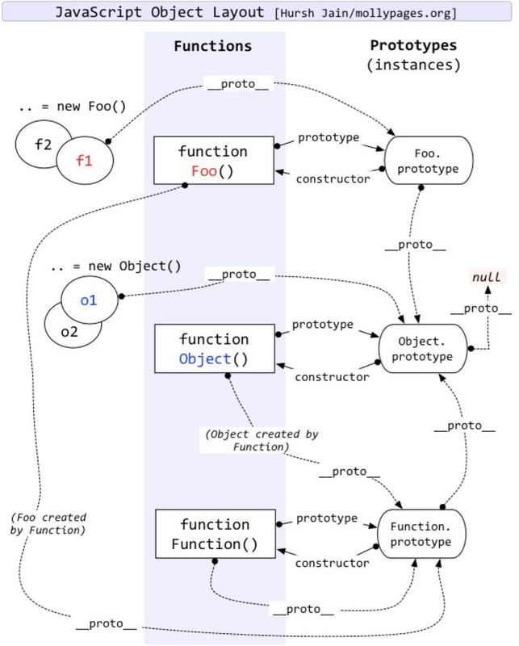

## 对象
  - 基本数据类型number、string、number、boolean、unll、undefined，本身不是对象。

  - **typeof null**结果为object，不同对象底层均表示为二进制，在JavaScript中二进制前三位均为0的，均被当做对象，null的二进制全是0，所以会返回object。

  - 内置对象Number、String、Boolean、Object、Function、Array、Date、Error、RegExp

  - 字面量是一个不可改变的值，在必要时候会自动转换成对象。

  - 对象的属性值为函数，但是这并不是其他语言所说的方法，在JavaScript中对象的属性为函数与普通的函数没有什么区别，唯一区别就是可能会发生this隐式绑定，因为最终this绑定取决于函数调用位置。

### 1. 创建对象的三种方式
  - 文字形式
    ```js
    var obj = {
      name: 'hello',
      age: 18,
      eat: function(){
        console.log('---eating---');
      }
    }
    ```

  - 系统构造函数
    ```js
    var obj = new Object();
    obj.name = 'hello';
    obj.age = 18;
    obj.eat = function(){
      console.log('---eat----');
    }
    ```

  - 自定义构造函数
    ```js
    function Person(name, age){
      this.name = name;
      this.age = age;
      this.eat = function(){
        console.log('---eating---');
      }
    }
    var obj = new Person('hello', 18);
    console.dir(Person);
    console.dir(obj);
    obj instanceof Person; // true
    obj instanceof Object; // true
    ```
  
  - 工厂模式创建对象
    ```js
    function createObject(name, age){
      var obj = new Object();
      obj.name = name;
      obj.age = age;
      obj.eat = function(){
        console.log('---eat---');
      }
      return obj;
    }
    var obj = createObject('hello', 18);
    ```

### 2. 构造函数与实例化对象之间关系
  - 实例对象是通过构造函数来创建的，创建过程称为**实例化**

  - 两种方式判断对象的数据类型
    - 通过构造函数(构造器)方式
      ```js
      // 实例对象.构造器 == 构造函数(构造器)名字
      function Person(name, age){
        this.name = name;
        this.age = age;
        this.eat = function(){
          console.log('---eating---');
        }
      }
      var obj = new Person('hello', 18);
      console.log(obj.constructor == Person);
      console.log(obj.__proto__.constractor == Person);
      console.log(obj.__proto__.constructor==Person.prototype.constructor);
      ```

    - 通过instanceof方式(**首选方法**)
      ```js
      console.log(obj instanceof Person);
      ```

### 3. 原型对象引入
  - 解决数据共享，节省内存空间
    ```js
    function Person(name, age){
      this.name = name;
      this.age = age;
    }
    Person.prototype.eat = function(){
      console.log('---eating---');
    };
    var p1 = new Person('hello', 18);
    var p2 = new Person('world', 20);
    console.log(p1 == p2); // false
    console.log(p1.eat == p2.eat); // true
    console.dir(p1);
    console.dir(p2);
    ```

  - 原型对象
    -  实例对象中有__proto__属性，叫做隐式原型对象，浏览器使用

    - 构造函数中有prototype属性，叫做显式原型对象，程序员使用

    - per.__ proto__.constructor == Person.prototype.constructor

    - __proto__之所以给浏览器使用，因为不同浏览器兼容不一样，ie就没有该属性

### 4. 实例对象、构造函数、原型对象关系图
  - 实例对象的原型对象(__ proto__)指向的是构造函数的原型对象

  - 构造函数的原型对象(prototype)中的方法是可以被实例对象直接访问的

  - **原型链** ：是一种关系，实例对象和原型对象之间的关系，关系是通过原型(__ proto__)来联系的。

  - 构造函数的原型对象(prototype)指向发生改变，实例对象的原型(__ proto__)指向也会发生改变。

      


### 5. Function与Object深入理解

  - Object.prototype

    - 表示Object的原型对象，其``__proto__``属性值为null，该访问器属性``__proto__``暴露了一个对象内部``[[Prototype]]``

    - Object.prototype并不是通过Object函数创建的

      ```js
      // 证明：
      function Foo(){
        this.value = 'foo';
      }
      var foo = new Foo();

      foo.__proto__ === Foo.prototype;  // true

      /*
      实例对象的__proto__指向构造函数的prototype，即
      foo.__proto指向Foo.prototype，
      但是Object.prototype.__proto__是null，
      所以Object.prototype并不是通过Object函数创建的。

      那么如何生成的？
      其实Object.prototype是浏览器底层根据ESCAScript规范创建的一个对象。

      Object.prototype就是原型链的顶端(不考虑null的情况下)，所有对象继承了它的toString()等方法和属性。
      */
      ```

  - Function.prototype

    - ``Function.prototype``对象是一个函数(对象)，其``[[Prototype]]``内部属性值指向内建对象``Object.prototype``

    - ``Function.prototype``对象自身没有valueof属性，其从``Object.prototype``对象继承了valueof属性

    - ``Function.prototype``的``[[Class]]``属性是Function，所以这是一个函数，但又不大一样。

      - 只有函数才有prototype属性，但并不是所有函数都有这个属性，因为``Function.prototype``这个函数就没有

        ```js
        Function.prototype  // f(){ [native code] }

        Function.prototype.prototype;  // undefined
        ```

        ```js
        var fun = Function.prototype.bind();  // f(){ [native code] }

        fun.prototype;  // undefined
        ```

  - function Object(){}

    - Object作为构造函数时，其``[[Prototype]]``内部属性值指向``Function.prototype``,即``Object.__proto === Function.prototype``

    - 原型链
      
      ```js
      var obj = {a: 1};
      // obj ---> Object.prototype ---> null

      var obj1 = ['yellow', 'blue'];
      // obj1 ---> Array.prototype ---> Object.prototype ---> null

      function foo(){
        return 2;
      }
      // f ---> Function.prototype ---> Object.prototype ---> null

      var obj2 = new Function();
      // obj2 ---> Function.prototype ---> Object.prototype ---> null

      function Fun(){

      }
      var obj3 = new Fun();
      // obj3 ---> Fun.prototype ---> Object.prototype ---> null

      function F(){
        return {};
      }
      var obj4 = new F();
      // obj4 ---> Object.prototype ---> null
      ```

  - function Function(){}

    - Function构造函数是一个函数对象，其``[[Class]]``属性是``Function``

    - Function的``[[Prototype]]``属性指向了``Function.prototype``，即``Function.__proto__ === Function.prototype``

  - Function与Object的问题

    - Object构造函数继承了``Function.prototype``，同时Function构造函数继承了``Object.prototype``，因为``Function.prototype``和``Function.__proto__``都指向``Function.prototype``

      ```js
      Object instanceof Function  // true
      Function instanceof Object  // true

      Object instanceof Object  // true
      Function instanceof Function  // true
      ```

    - 第一种解释：Function是built-in的对象，也就是并不存在``Function对象由Function构造函数创建``这样问题。实际上，当你直接写一个函数时，如(``function f(){}``)，也不存在调用Function构造函数，只有在显示调用Function构造函数时，如(``new Function('x', 'return x')``)才有。


### 6. 原型语法
  - 手动修改构造器指向
    ```js
    function Person(name, age){
      this.name = name;
      this.age = age;
    }
    Person.prototype = {
      constructor: Person,  // 手动修改构造器指向
      eye: 2,
      ear: 2,
      eat: function(){
        console.log('---eat---');
      }
    }
    ```

  - 原型中的方法，可以相互访问
    ```js
    function Person(name, age){
      this.name = name;
      this.age = age;
    }
    Person.prototype.eat = function(){
      console.log('---eat---');
      this.drink();
    }
    Person.prototype.drink = function(){
      console.log('---drink---');
      this.sleep();
    }
    Person.prototype.sleep = function(){
      console.log('---sleep---');
    }
    ```
  - 实例对象使用的属性和方法层层调用关系
    - 首先**实例中查找**，然后**去创建该实例对象的的构造函数的原型对象中查找**

### 7. Object.getPrototypeOf()
  - 返回指定对象的原型对象

### 8. 属性设置和屏蔽
  - foo不直接存在obj中，而是存在于原型链上层时obj.foo = 'bar'会出现三种情况

    - 如果在__ proto__上层存在名为foo的普通数据访问属性，并且没有被标记为只读(writable:false)，那就会直接在obj中添加一个名为foo的新属性，它是**屏蔽属性**。======> 只读属性是什么意思？

    - 如果在__ proto__上层存在foo，但是它被标记只读(writable:false)，那么无法修改已有属性或则在obj上创建屏蔽属性。如果运行在严格模式下，代码会抛出错误。否则，这条赋值语句会被忽略。总之，不会发生屏蔽。

    - 如果在__ proto__上层存在foo并且它是一个setter，那就一定会调用这个setter。foo不会被添加到(或则说屏蔽于)obj，也不会重新定义foo这个setter。

  - 隐式屏蔽
    ```js
      var obj1 = {
        a: 2
      };
      var obj2 = Object.create(obj1);
      console.log(obj2.a);  // 2
      console.log(obj1.a);  // 2
      console.log(obj1.hasOwnProperty('a'));  // false
      console.log(obj1.hasOwnProperty('a'))  // true

      // 隐式屏蔽
      obj2.a++;  // obj2.a = obj2.a + 1;
      console.log(obj2.a);  // 3
      console.log(obj1.a);  // 2
      console.log(obj2.hasOwnProperty('a'));  // true
    ```


### 3. 属性描述符
  - Object.getOwnPropertyDescriptor(obj, key)
    
    ```js
      var obj = {
        a: 2
      };
      Object.getOwnPropertyDescriptor(obj, 'a');
      # 结果
      {
        value: 2,
        writable: true,
        enumerable: true,
        configurable: true
      }
    ```
  
  - Object.defineProperty(obj, key, {})
    ```js
    var obj = {};
    Object.defineProperty(obj, key, {
      value: 2,
      writable: true,  // 是否可以重新赋值
      enumerable: true,  // 是否可以枚举,for in 遍历其属性
      configurable: true, // 是否可以重新定义，一旦为false，就不能重新配置，以及删除该key，单向操作。
    })
    `````

  - 对象常量：configurable:false, writable:false

  - 阻止扩展: Object.preventExtensions(obj)

  - 密封: Object.seal(),实质是在阻止扩展基础上加了configurable: false

  - 冻结: Object.freeze(),实质是在seal基础上加了wirtable: false
  
### 对象遍历
  - for...in循环可以用来遍历对象的可枚举属性列表(包括[prototype]链)。

  - for...of实现原理
    ```js
      var obj = {
        a: 2,
        b: 3
      },
      Object.defineProperty(obj, Symbol.iterator, {
        enumerable: false,
        writable: false,
        configurable: false,
        value: function(){
          var _this = this;
          var index = 0;
          var keys = Object.keys(_this);
          return {
            next: function(){
              return {
                value: _this[keys[index++]],
                done: (index < keys.length>)
              };
            }
          };
        }
      })
      var iterator = obj[Symbol.iterator]();
      iterator.next();  // {value: 2, done: false}
      iterator.next();  // {value: 3, done: false}
      iterator.next();  // {value: undefined, done: true}
    ```